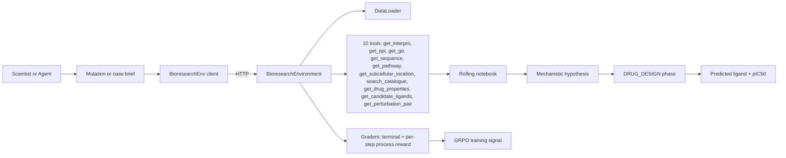
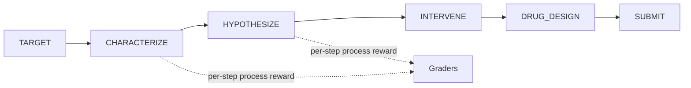

# Bioresearch — Project Blog

**Bioreseach** is an [OpenEnv](https://github.com/openenv-dev/openenv) environment for training and evaluating LLMs on real biomedical reasoning: mutations, proteins, radiology cases, CRISPRi perturbations, and small-molecule drug design.

## The stakes

There are roughly **7,000 known rare diseases**, affecting around **350 million people**, and **~95% of them have no FDA-approved therapy**. Each of those gaps is gated by the same human-expert workflow: a scientist reads a variant brief, pulls evidence from five-to-ten databases (UniProt, InterPro, PPI, GO, KEGG, ChEMBL, AlphaFold, ...), reasons across that evidence toward a mechanism, and proposes a concrete molecule with a measurable pIC50.

Aging is the upstream multiplier on top of that. Cancer, Alzheimer's, cardiovascular disease, type-2 diabetes — the biggest mortality drivers all scale with biological age. If we want our generation to live to the **22nd century**, we have to industrialise the *mutation → mechanism → molecule* loop and run it across thousands of senescence and longevity targets in parallel.

Frontier LLMs are the natural substrate for that, and they are also where we keep getting stuck. So we built an OpenEnv that trains for exactly that loop.

---

## 1. TL;DR

- **14 tasks** — 9 single-step benchmarks and 5 long-horizon "lab" tasks — all in one HTTP-exposed environment. Full list in [README.md](https://github.com/AnirudhChidananda/bioresearch/blob/main/README.md).
- **11 tools** (`get_interpro`, `get_ppi`, `get_go`, `get_sequence`, `get_subcellular_location`, `search_catalogue`, `get_pathway`, `get_drug_properties`, `get_candidate_ligands`, `get_perturbation_pair`, `get_structure`) that the agent chains like a real scientist chains database lookups. `get_structure` surfaces an AlphaFold reference so the final hypothesis quotes a concrete structure id.
- **Phased state machine** — `TARGET → CHARACTERIZE → HYPOTHESIZE → INTERVENE → DRUG_DESIGN → SUBMIT` — with a new `DRUG_DESIGN` closing move that makes the lab output a concrete SMILES, not an abstract "inhibit X".
- **GRPO-ready reward shape.** Every grader returns a score in `[0.01, 0.99]` with continuous partial credit. Long-horizon tasks also emit *dense per-step process rewards* computed from gold `<think>` traces. No coin-flip 0/1 rewards anywhere.
- **Shipped artefacts.** Deterministic DataLoader ([server/data_loader.py](https://github.com/AnirudhChidananda/bioresearch/blob/main/server/data_loader.py)), continuous graders ([server/graders.py](https://github.com/AnirudhChidananda/bioresearch/blob/main/server/graders.py)), 
Unsloth + TRL GRPO Colab ([Colab Notebook](https://colab.research.google.com/drive/1UIJTvMm2cWBpM46FI_MFEEthvN7JS-Q0))
HuggingFace - ([Space](https://huggingface.co/spaces/anirudhchida/bioresearch)) ([Trackio](https://huggingface.co/spaces/anirudhchida/trackio))

---

## 2. Why this matters for science

Modern drug discovery, rare-disease diagnosis, and ageing research all bottleneck on the same human-expert workflow:

1. A scientist reads a variant brief or case notes.
2. They pull evidence from five to ten databases (UniProt, InterPro, PPI, GO, KEGG, ChEMBL, ...).
3. They reason across that evidence toward a mechanism.
4. They propose an intervention — ideally a concrete molecule, not a prose sentence.

Frontier LLMs are good at *step 3* in isolation, and they are passable at *step 1* when the brief is clean. They are systematically bad at the full loop because:

- They don't know when to stop pulling evidence.
- They redo the same tool call three times.
- They hallucinate intermediate steps rather than reading them off a notebook.
- They stop at "inhibit PDE11A" rather than committing to an actual SMILES with a measurable pIC50.

This environment trains *that whole loop* , which argued that the frontier bottleneck in biomedicine is reasoning discipline, not raw knowledge. We operationalise that claim inside an OpenEnv that TRL GRPO can talk to directly.

---

## 3. How LLMs improve by training here

Four concrete capability gains, each tied to specific tasks and specific data:

### 3.1 Long-horizon tool-calling discipline

The lab tasks (`target_discovery_lab`, `protein_hypothesis_lab`, `clinical_diagnosis_lab`, `curriculum_self_play`) force the model through a phased state machine:

```
TARGET → CHARACTERIZE → HYPOTHESIZE → INTERVENE → DRUG_DESIGN → SUBMIT
```

The observation at every step exposes `phase`, `remaining_steps`, `notebook` (a rolling evidence log), `tool_result`, and `available_tools`. A model that fires off `get_interpro` three times in a row gets explicitly penalised by `[grade_tool_efficiency](https://github.com/AnirudhChidananda/bioresearch/blob/main/server/graders.py)` in the terminal reward. A model that keeps an orderly notebook and converges in 8 steps gets rewarded.

### 3.2 Dense per-step process reward from gold `<think>` traces

This is the single most distinctive piece. [data/Protien_catalogue.json](https://github.com/AnirudhChidananda/bioresearch/blob/main/data/Protien_catalogue.json) and [data/diagnosis_training_data.json](https://github.com/AnirudhChidananda/bioresearch/blob/main/data/diagnosis_training_data.json) ship with step-wise chain-of-thought traces generated by senior-scientist-verified frontier models (GPT-OSS-120B in the diagnosis case). Every intermediate `reasoning` field the agent produces is scored by `grade_process_trace` against the best-matching unseen gold step. Concretely:

```
per_step_reward = max over unseen gold steps of difflib.SequenceMatcher(agent_step, gold_step)
```

This gives GRPO a visible reward gradient within a few hundred training steps rather than waiting for terminal rollouts to propagate.

### 3.3 CRISPRi world modeling

[data/PertubationQA_language_pert_de.json](https://github.com/AnirudhChidananda/bioresearch/blob/main/data/PertubationQA_language_pert_de.json)  drives the `perturbation_qa` task: an episode is a *batch* of ~10 binary CRISPRi questions ("does knocking down query_gene change target_gene in cell_line X?"). The reward is `0.5 * balanced_accuracy + 0.5 * macro_F1`, clamped to `[0.01, 0.99]`. Missing predictions count as neutral (0.5) rather than wrong, so the model can't collapse to always-yes / always-no.

The resulting reward curve is the sharpest one in the Colab — tiny prompts, single-token answers, continuous F1 reward, no tool overhead.

**v3 upgrade — directional perturbation.** [data/PertubationQA_language_pert_dir.json](https://github.com/AnirudhChidananda/bioresearch/blob/main/data/PertubationQA_language_pert_dir.json) turns the binary task into a 3-class problem (`Increase` / `Decrease` / `Unknown`) via `perturbation_direction_qa`, and `perturbation_benchmark` runs it across four CRISPRi variants (`pert_dir`, `pert_de`, `gse_pert`, `gse_gene`) for a single umbrella score. The extra label entropy sharpens the GRPO advantage per step, so the Colab now shows *three* reward curves with the 3-class curve climbing faster than the binary one.

### 3.4 KEGG pathway-graph reasoning (v3)

[data/kegg_reasoning.json](https://github.com/AnirudhChidananda/bioresearch/blob/main/data/kegg_reasoning.json) + [data/kegg_reasoning_2.json](https://github.com/AnirudhChidananda/bioresearch/blob/main/data/kegg_reasoning_2.json) ship a declarative KEGG-style graph per case — e.g. `TARDBP* -| CxI -> Q -> NLS` — alongside prose pathway context and a gold disease label. The `kegg_pathway_reasoning` task asks the agent to identify the disease, *quote the graph edges* in its reasoning, and enumerate the genes it cites. The reward blends disease accuracy (30%), pathway-graph Jaccard on the tokenised edges (25%), process-trace similarity (25%), and pathway-gene coverage F1 (20%). This pushes the model from "memorise the answer" to "reason on the declared topology" — a world-modeling primitive we did not previously train.

### 3.5 Concrete molecules, not abstract interventions

The `ligand_design` task and the new `DRUG_DESIGN` phase turn the previous lab output — `{"mode": "inhibit", "target": "PDE11A"}` — into an actual SMILES string with a measurable pIC50 from [data/SMILES_top1000_drug_discovery.json](https://github.com/AnirudhChidananda/bioresearch/blob/main/data/SMILES_top1000_drug_discovery.json). Grading is a pure-Python blend (SMILES token Jaccard + named-drug match + top-1000 catalogue membership + property proximity) so there is no rdkit dependency and nothing to install.

This is what closes the mutation→molecule loop, and it is the payoff slide in the pitch.

---

## 4. Architecture at a glance




The subgraph that really matters is the phase machine inside `Env`:




Source files: [server/bioresearch_environment.py](https://github.com/AnirudhChidananda/bioresearch/blob/main/server/bioresearch_environment.py), [server/graders.py](https://github.com/AnirudhChidananda/bioresearch/blob/main/server/graders.py), [server/data_loader.py](https://github.com/AnirudhChidananda/bioresearch/blob/main/server/data_loader.py).

---

## 5. Task catalogue

Full schema in [README.md](https://github.com/AnirudhChidananda/bioresearch/blob/main/README.md). The catalogue is organised into five narrative scenes (variant → protein → systems biology → clinical → long-horizon labs), and the table below is annotated with what each task teaches the model.


| Scene | Task                        | Mode                   | What the model learns                                                                                                |
| ----- | --------------------------- | ---------------------- | -------------------------------------------------------------------------------------------------------------------- |
| 1     | `dna_classification`        | single-step            | Map a variant brief to the correct disease label (easy-difficulty curriculum floor).                                 |
| 1     | `dna_reasoning`             | single-step            | Articulate the mutation→pathway→phenotype mechanism, not just the label.                                             |
| 1     | `evidence_ranking`          | single-step            | Rank candidates *and* justify why each distractor is wrong — forces structured elimination.                          |
| 2     | `protein_function`          | single-step            | Predict function + subcellular location + leaf-level GO terms from sequence + domains.                               |
| 3     | `kegg_pathway_reasoning`    | single-step            | Reason on a declarative KEGG pathway graph (`TARDBP* -                                                               |
| 3     | `perturbation_qa`           | single-step batch      | Predict CRISPRi knock-down effects across a batch of gene pairs. Pure world-modeling signal.                         |
| 3     | `perturbation_direction_qa` | single-step batch      | 3-class directional CRISPRi prediction (`Increase`/`Decrease`/`Unknown`) — sharper GRPO signal than the binary task. |
| 3     | `perturbation_benchmark`    | single-step batch      | Umbrella over four CRISPRi variants with equal weights; single score that compares directional reasoning end-to-end. |
| 4     | `clinical_diagnosis`        | single-step            | Commit to a final diagnosis and mirror the gold GPT-OSS-120B step-wise CoT. Teaches clinical reasoning discipline.   |
| 5     | `protein_hypothesis_lab`    | long-horizon           | Characterise an unfamiliar protein through tool chains, with per-step reward from gold `<think>` traces.             |
| 5     | `target_discovery_lab`      | long-horizon           | Full mutation→target→intervention→ligand loop with tool calls and dense process reward.                              |
| 5     | `clinical_diagnosis_lab`    | long-horizon           | Diagnostic lab with tool access + dense per-step process reward from gptoss120b reasoning.                           |
| 5     | `ligand_design`             | short-horizon          | Propose a high-pIC50 molecule for a gene; graded by Jaccard + property proximity + catalogue membership.             |
| 5     | `curriculum_self_play`      | long-horizon, adaptive | Capstone — same lab loop with tool outputs progressively hidden as the model improves, internalising biology.        |


**Intentional nested scaffolding.** Two pairs share graders with richer tasks by design rather than accident: `dna_classification` is the answer-only term inside `grade_dna_reasoning`, and `perturbation_direction_qa` is reused as one of four 25% slices in `grade_perturbation_benchmark`. We keep both standalone because they are the cleanest low-variance diagnostics in the registry — and because the 3-class directional curve is one of the three headline GRPO reward curves in the Colab. See the "Intentional nested-grader scaffolding" note in [README.md](https://github.com/AnirudhChidananda/bioresearch/blob/main/README.md).

---

## 6. Reward design

All graders clamp to `[0.01, 0.99]`. This matters more than it sounds:

- GRPO's group-relative baseline subtracts the mean reward across `num_generations` samples. If any reward pins at exactly 0 or 1, the baseline becomes trivially wrong and the policy update collapses.
- Clamping to a small positive floor (0.01) keeps the gradient alive when the model is badly wrong; a ceiling of 0.99 prevents early "solved" collapse on easy tasks.

Full weighting tables live in [README.md](https://github.com/AnirudhChidananda/bioresearch/blob/main/README.md). Summary of the v2 additions:


| Component                                           | `clinical_diagnosis` | `clinical_diagnosis_lab` | `perturbation_qa` | `ligand_design` |
| --------------------------------------------------- | -------------------- | ------------------------ | ----------------- | --------------- |
| Final diagnosis match                               | 30%                  | 70% × 30%                | —                 | —               |
| Differential ranking                                | 25%                  | 70% × 25%                | —                 | —               |
| Gold CoT process trace                              | 25%                  | 70% × 25%                | —                 | —               |
| Reasoning quality                                   | 20%                  | 70% × 20%                | —                 | —               |
| Tool efficiency                                     | —                    | 30%                      | —                 | 20%             |
| Macro-F1 + balanced accuracy                        | —                    | —                        | 100%              | —               |
| SMILES token Jaccard                                | —                    | —                        | —                 | 80% × 40%       |
| Named-drug / SMILES equality bonus                  | —                    | —                        | —                 | 80% × 25%       |
| Top-1000 catalogue membership (drug_score weighted) | —                    | —                        | —                 | 80% × 25%       |
| Property proximity (logP, num_atoms)                | —                    | —                        | —                 | 80% × 10%       |


For the host labs (`target_discovery_lab`, `protein_hypothesis_lab`) the DRUG_DESIGN addon is folded into the terminal reward at ≤15% weight so it cannot dominate the existing mechanistic-hypothesis signal.

---

## 7. Scientific use cases

Four concrete examples showing the task → output → scientist value chain.

**Ageing target discovery.** Reset `target_discovery_lab` with a brief for an under-studied senescence gene. The agent calls `get_ppi` and `get_pathway` to localise the gene in the senescence-associated secretory phenotype (SASP) network, chooses an intervention mode, and the DRUG_DESIGN phase returns a high-pIC50 candidate molecule from the top-1000 catalogue. The scientist gets a ranked hypothesis + starter molecule in seconds, not days.

**Rare-disease diagnosis.** Reset `clinical_diagnosis_lab` with a radiology brief. The agent ranks differentials, explains why each distractor is eliminated, and its step-wise reasoning is scored against a gold GPT-OSS-120B trace. Clinicians can inspect the reasoning trace, not just the final label — the exact failure mode that has historically blocked LLMs from clinical use.

**CRISPRi screen triage.** Reset `perturbation_qa` for a batch of ~10 knock-down hypotheses from a real screen. The agent returns a binary answer per pair with calibrated F1. A wet-lab scientist can de-prioritise the low-confidence pairs before committing reagents.

**Ligand repurposing.** Reset `ligand_design` for a target with a GO neighbourhood prompt. The agent emits a SMILES plus `get_drug_properties` readout; if the molecule is already in the top-1000 catalogue, the catalogue-membership bonus fires, revealing a plausible repurposing candidate.

---

## A worked example: PDE11A → Cushing → SMILES

1. **Brief.** A mutation on chromosome 2p16.3 with a cAMP pathway.
2. `**get_pathway(gene="PDE11A")*`* → notebook fills with the downstream PKA cascade.
3. `**get_interpro(...)**` → "Phosphodiesterase domain, 3',5'-cyclic AMP PDE."
4. `**get_go(protein_id=...)**` → `GO:0004114` (cAMP phosphodiesterase activity, leaf).
5. **Submit** `answer="Cushing syndrome"`, `proposed_intervention={"mode": "activate", "target": "PDE11A"}`.
6. **DRUG_DESIGN window.** `get_candidate_ligands(gene="PDE11A", k=5)` returns a ranked list from the top-1000 SMILES catalogue. Pick one, call `get_drug_properties(smiles=...)` → `pIC50=10.6, logP=1.47, in_catalogue=True`. Submit `predicted_ligand=<SMILES>`.
7. **Score panel:** disease 0.95 · leaf-GO F1 0.80 · intervention plausible 0.70 · tool efficiency 0.90 · trace coherence 0.78 · drug_design addon 0.71 → **terminal reward 0.86**.

Every tool call moved the reward. That is the whole point.

## Closing — the 22nd-century bet

Every drug we will ever make starts with a scientist reading a mutation brief, pulling evidence from a handful of databases, and committing to a molecule. That loop is the rate-limiter on rare-disease therapeutics, on dementia drugs, on senolytics, on every longevity intervention worth running. We can finally *train* it. Not just evaluate it — *train* it, with dense per-step process rewards from real gold reasoning traces, with deterministic tool calls, and with a phased state machine that ends in a SMILES.

References:- 

```
Evo2 : https://github.com/arcinstitute/evo2
Noetik: https://www.noetik.ai/octo
Bioreason : https://arxiv.org/abs/2505.23579
Alphagenome (Google Deepmind): https://deepmind.google.com/science/alphagenome/
Alphafold (Google Deepmind): https://alphafold.ebi.ac.uk/
Dr. David Sinclar :  https://www.youtube.com/watch?v=DnvWAP99r3Y&t=1910s
```

