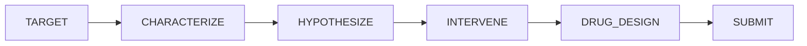

# Bioresearch — Teaching LLMs the Drug Discovery Loop

*An OpenEnv environment + GRPO recipe for rare disease, aging, and longevity research.*

> **Links:** [Live Space](<HF_SPACE_URL>) · [GRPO Colab](<COLAB_BADGE_URL>) · [Trackio dashboard](<TRACKIO_URL>) · [Trained LoRA](<HF_MODEL_URL>) · [Demo video](<YOUTUBE_URL>) · [Pitch deck](<SLIDES_URL>) · [GitHub](<GITHUB_URL>)

---

## The stakes

There are roughly **7,000 known rare diseases**, affecting around **350 million people**, and **~95% of them have no FDA-approved therapy**. Each of those gaps is gated by the same human-expert workflow: a scientist reads a variant brief, pulls evidence from five-to-ten databases (UniProt, InterPro, PPI, GO, KEGG, ChEMBL, AlphaFold, ...), reasons across that evidence toward a mechanism, and proposes a concrete molecule with a measurable pIC50.

Aging is the upstream multiplier on top of that. Cancer, Alzheimer's, cardiovascular disease, type-2 diabetes — the biggest mortality drivers all scale with biological age. If we want our generation to live to the **22nd century**, we have to industrialise the *mutation → mechanism → molecule* loop and run it across thousands of senescence and longevity targets in parallel.

Frontier LLMs are the natural substrate for that, and they are also where we keep getting stuck. So we built an OpenEnv that trains for exactly that loop.

## Why frontier LLMs fail at this loop today

LLMs are *decent* at single-turn biomedical QA and they are *good* at writing prose mechanisms when you hand them the evidence. They are systematically bad at the full loop because:

1. **They don't know when to stop pulling evidence.** They keep calling tools long after the notebook contains the answer.
2. **They redo the same call.** A model that fires `get_interpro` three times in a row is bleeding budget.
3. **They hallucinate intermediate steps** rather than reading them off a notebook.
4. **They stop at "inhibit PDE11A"** rather than committing to an actual SMILES with a measurable pIC50.

The fix is not a bigger model. The fix is a training environment that makes each of those failure modes *cost reward*.

## What I shipped

The Bioresearch Environment is **14 tasks** organised into 5 narrative scenes (variant reasoning → protein function → systems biology → clinical → long-horizon labs), exposed over HTTP via OpenEnv, with **11 deterministic tools** and a phased state machine that ends in a real molecule:



Tools the agent can chain: `get_interpro`, `get_ppi`, `get_go`, `get_sequence`, `get_subcellular_location`, `search_catalogue`, `get_pathway`, `get_drug_properties`, `get_candidate_ligands`, `get_perturbation_pair`, and `get_structure` (AlphaFold reference, so the closing hypothesis can quote a concrete `AF-…cif` id). Single-step tasks include DNA mutation classification and reasoning, evidence ranking, protein function prediction, KEGG pathway-graph reasoning, batched CRISPRi world modeling (binary + 3-class directional + 4-variant umbrella benchmark), and clinical radiology differentials. The five long-horizon labs (`protein_hypothesis_lab`, `target_discovery_lab`, `clinical_diagnosis_lab`, `ligand_design`, `curriculum_self_play`) are the hackathon hero — see [server/bioresearch_environment.py](server/bioresearch_environment.py) and the full catalogue in the [README](README.md).

## Reward design in three rules

1. **Clamp every grader to `[0.01, 0.99]`.** GRPO's group-relative baseline subtracts the mean reward across `num_generations`. If anything pins to `0` or `1`, the baseline degenerates and the policy update collapses. A `0.01` floor keeps the gradient alive when the model is wrong; a `0.99` ceiling prevents early collapse on easy tasks.
2. **Dense per-step process reward.** During CHARACTERIZE/HYPOTHESIZE we score the agent's `reasoning` field at every step against the best-matching unseen gold `<think>` step from [data/Protien_catalogue.json](data/Protien_catalogue.json), using `difflib.SequenceMatcher`. GRPO sees a visible reward gradient within hundreds — not thousands — of steps.
3. **Terminal blend, not a coin-flip.** The lab terminal reward mixes disease/function accuracy, leaf-level GO F1, intervention plausibility, tool efficiency (redundant calls penalised), trace coherence with the notebook, and — when the agent emits a `predicted_ligand` — a DRUG_DESIGN addon (≤15% weight) blending SMILES Jaccard, named-drug match, top-1000 catalogue membership, and property proximity. All weights are in [server/graders.py](server/graders.py).

## The GRPO training story

We GRPO-fine-tuned **Qwen2.5-1.5B-Instruct** with **Unsloth 4-bit + TRL** on a free Colab T4 against the live OpenEnv server. ~150 steps, ~45 minutes wall-clock. The full notebook is [notebooks/train_grpo_colab.ipynb](notebooks/train_grpo_colab.ipynb); the shared rollout/reward core is in [training_core.py](training_core.py).

The key trick is the reward closure. TRL forwards every dataset column through `**kwargs`, so we thread `task_id` from the prompt all the way through to the reward function — and reset the env against *the same brief the completion answers*:

```python
def reward_lab_episode(prompts, completions, **kwargs):
    rewards = []
    for completion, task_id in zip(completions, kwargs["task_id"]):
        action_dict = parse_first_json(completion) or {"submit": True, "answer": ""}
        action_dict["submit"] = True  # immediate-submit rollout
        env_reset(task_id=task_id)
        result = env_step(BioresearchAction(task_id=task_id, **action_dict))
        rewards.append(float(result.reward))
    return rewards
```

Skip the `task_id` thread and every completion is graded against a *different* brief — the curve looks noisy and the model never learns. With it threaded, GRPO has a clean group-relative signal, and the notebook overlays three reward curves side-by-side:


Headline lift: **`protein_hypothesis_lab` climbs from ~0.29 baseline → ~0.48** after 150 GRPO steps. The 3-class directional CRISPRi curve climbs fastest because the extra label entropy sharpens the GRPO advantage per step. Live numbers stream to the [Trackio dashboard](<TRACKIO_URL>).

## A worked example: PDE11A → Cushing → SMILES

To make the loop concrete, here's a single `target_discovery_lab` rollout (also the demo in the [video](<YOUTUBE_URL>)):

1. **Brief.** A mutation on chromosome 2p16.3 with a cAMP pathway.
2. **`get_pathway(gene="PDE11A")`** → notebook fills with the downstream PKA cascade.
3. **`get_interpro(...)`** → "Phosphodiesterase domain, 3',5'-cyclic AMP PDE."
4. **`get_go(protein_id=...)`** → `GO:0004114` (cAMP phosphodiesterase activity, leaf).
5. **Submit** `answer="Cushing syndrome"`, `proposed_intervention={"mode": "activate", "target": "PDE11A"}`.
6. **DRUG_DESIGN window.** `get_candidate_ligands(gene="PDE11A", k=5)` returns a ranked list from the top-1000 SMILES catalogue. Pick one, call `get_drug_properties(smiles=...)` → `pIC50=10.6, logP=1.47, in_catalogue=True`. Submit `predicted_ligand=<SMILES>`.
7. **Score panel:** disease 0.95 · leaf-GO F1 0.80 · intervention plausible 0.70 · tool efficiency 0.90 · trace coherence 0.78 · drug_design addon 0.71 → **terminal reward 0.86**.

Every tool call moved the reward. That is the whole point.

## Reproducibility

```bash
uv sync
uvicorn server.app:app --host 127.0.0.1 --port 8000
# in another terminal: open notebooks/train_grpo_colab.ipynb (or click the Colab badge)
```

To deploy to a Hugging Face Space: `openenv push`. Full step-by-step in [knowledgebase/training_guide.md](knowledgebase/training_guide.md).

## Closing — the 22nd-century bet

Every drug we will ever make starts with a scientist reading a mutation brief, pulling evidence from a handful of databases, and committing to a molecule. That loop is the rate-limiter on rare-disease therapeutics, on dementia drugs, on senolytics, on every longevity intervention worth running. We can finally *train* it. Not just evaluate it — *train* it, with dense per-step process rewards from real gold reasoning traces, with deterministic tool calls, and with a phased state machine that ends in a SMILES.

If you believe — as we do — that our generation has a real shot at the 22nd century, the work is to industrialise that loop. This environment is one trainable substrate for that bet. Open the [Space](<HF_SPACE_URL>), watch the [video](<YOUTUBE_URL>), run the [Colab](<COLAB_BADGE_URL>), and ship your own agent against it.
