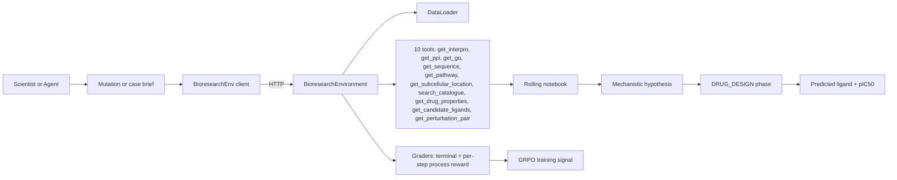
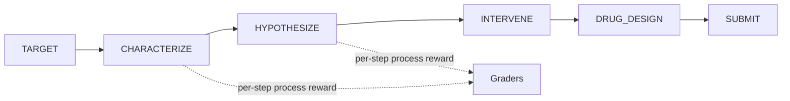

# Bioresearch — Project Brief

A detailed, audience-spanning brief for the Bioresearch OpenEnv. Written for both biologists / PIs who want to know _why this matters for drug discovery_ and ML engineers who want to know _what the model is actually being trained on_.

---

## 1. TL;DR

- **What it is.** An [OpenEnv](https://github.com/openenv-dev/openenv) environment for training and evaluating LLMs on real biomedical reasoning: mutations, proteins, radiology cases, CRISPRi perturbations, and small-molecule drug design.
- **11 tasks** — 6 single-step benchmarks and 5 long-horizon "lab" tasks — all in one HTTP-exposed environment. Full list in [README.md](../README.md) and [openenv.yaml](../openenv.yaml).
- **10 tools** (`get_interpro`, `get_ppi`, `get_go`, `get_sequence`, `get_subcellular_location`, `search_catalogue`, `get_pathway`, `get_drug_properties`, `get_candidate_ligands`, `get_perturbation_pair`) that the agent chains like a real scientist chains database lookups.
- **Phased state machine** — `TARGET → CHARACTERIZE → HYPOTHESIZE → INTERVENE → DRUG_DESIGN → SUBMIT` — with a new `DRUG_DESIGN` closing move that makes the lab output a concrete SMILES, not an abstract "inhibit X".
- **GRPO-ready reward shape.** Every grader returns a score in `[0.01, 0.99]` with continuous partial credit. Long-horizon tasks also emit _dense per-step process rewards_ computed from gold `<think>` traces. No coin-flip 0/1 rewards anywhere.
- **Shipped artefacts.** Deterministic DataLoader ([server/data_loader.py](../server/data_loader.py)), continuous graders ([server/graders.py](../server/graders.py)), Unsloth + TRL GRPO Colab ([notebooks/train_grpo_colab.ipynb](../notebooks/train_grpo_colab.ipynb)), Gradio playground ([playground.py](../playground.py)), and 82 passing tests.

---

## 2. Why this matters for science

Modern drug discovery, rare-disease diagnosis, and ageing research all bottleneck on the same human-expert workflow:

1. A scientist reads a variant brief or case notes.
2. They pull evidence from five to ten databases (UniProt, InterPro, PPI, GO, KEGG, ChEMBL, ...).
3. They reason across that evidence toward a mechanism.
4. They propose an intervention — ideally a concrete molecule, not a prose sentence.

Frontier LLMs are good at _step 3_ in isolation, and they are passable at _step 1_ when the brief is clean. They are systematically bad at the full loop because:

- They don't know when to stop pulling evidence.
- They redo the same tool call three times.
- They hallucinate intermediate steps rather than reading them off a notebook.
- They stop at "inhibit PDE11A" rather than committing to an actual SMILES with a measurable pIC50.

This environment trains _that whole loop_. The framing is directly inspired by the BioReason model series from Arc Institute / Xaira Therapeutics (summary in [knowledgebase/bioreseach.md](bioreseach.md)), which argued that the frontier bottleneck in biomedicine is reasoning discipline, not raw knowledge. We operationalise that claim inside an OpenEnv that TRL GRPO can talk to directly.

---

## 3. How LLMs improve by training here

Four concrete capability gains, each tied to specific tasks and specific data:

### 3.1 Long-horizon tool-calling discipline

The lab tasks (`target_discovery_lab`, `protein_hypothesis_lab`, `clinical_diagnosis_lab`, `curriculum_self_play`) force the model through a phased state machine:

```
TARGET → CHARACTERIZE → HYPOTHESIZE → INTERVENE → DRUG_DESIGN → SUBMIT
```

The observation at every step exposes `phase`, `remaining_steps`, `notebook` (a rolling evidence log), `tool_result`, and `available_tools`. A model that fires off `get_interpro` three times in a row gets explicitly penalised by [`grade_tool_efficiency`](../server/graders.py) in the terminal reward. A model that keeps an orderly notebook and converges in 8 steps gets rewarded.

### 3.2 Dense per-step process reward from gold `<think>` traces

This is the single most distinctive piece. [data/Protien_catalogue.json](../data/Protien_catalogue.json) and [data/diagnosis_training_data.json](../data/diagnosis_training_data.json) ship with step-wise chain-of-thought traces generated by senior-scientist-verified frontier models (GPT-OSS-120B in the diagnosis case). Every intermediate `reasoning` field the agent produces is scored by `grade_process_trace` against the best-matching unseen gold step. Concretely:

```
per_step_reward = max over unseen gold steps of difflib.SequenceMatcher(agent_step, gold_step)
```

This gives GRPO a visible reward gradient within a few hundred training steps rather than waiting for terminal rollouts to propagate.

### 3.3 CRISPRi world modeling

[data/PertubationQA_language_pert_de.json](../data/PertubationQA_language_pert_de.json) drives the `perturbation_qa` task: an episode is a _batch_ of ~10 binary CRISPRi questions ("does knocking down query_gene change target_gene in cell_line X?"). The reward is `0.5 * balanced_accuracy + 0.5 * macro_F1`, clamped to `[0.01, 0.99]`. Missing predictions count as neutral (0.5) rather than wrong, so the model can't collapse to always-yes / always-no.

The resulting reward curve is the sharpest one in the Colab — tiny prompts, single-token answers, continuous F1 reward, no tool overhead.

### 3.4 Concrete molecules, not abstract interventions

The `ligand_design` task and the new `DRUG_DESIGN` phase turn the previous lab output — `{"mode": "inhibit", "target": "PDE11A"}` — into an actual SMILES string with a measurable pIC50 from [data/SMILES_top1000_drug_discovery.json](../data/SMILES_top1000_drug_discovery.json). Grading is a pure-Python blend (SMILES token Jaccard + named-drug match + top-1000 catalogue membership + property proximity) so there is no rdkit dependency and nothing to install.

This is what closes the mutation→molecule loop, and it is the payoff slide in the pitch.

---

## 4. Architecture at a glance



The subgraph that really matters is the phase machine inside `Env`:



Source files: [server/bioresearch_environment.py](../server/bioresearch_environment.py), [server/graders.py](../server/graders.py), [server/data_loader.py](../server/data_loader.py).

---

## 5. Task catalogue

Full schema in [README.md](../README.md). Annotated with what each task teaches the model:

| Task                     | Mode                   | What the model learns                                                                                              |
| ------------------------ | ---------------------- | ------------------------------------------------------------------------------------------------------------------ |
| `dna_classification`     | single-step            | Map a variant brief to the correct disease label (sanity-check task).                                              |
| `dna_reasoning`          | single-step            | Articulate the mutation→pathway→phenotype mechanism, not just the label.                                           |
| `evidence_ranking`       | single-step            | Rank candidates _and_ justify why each distractor is wrong — forces structured elimination.                        |
| `protein_function`       | single-step            | Predict function + subcellular location + leaf-level GO terms from sequence + domains.                             |
| `clinical_diagnosis`     | single-step            | Commit to a final diagnosis and mirror the gold GPT-OSS-120B step-wise CoT. Teaches clinical reasoning discipline. |
| `perturbation_qa`        | single-step batch      | Predict CRISPRi knock-down effects across a batch of gene pairs. Pure world-modeling signal.                       |
| `target_discovery_lab`   | long-horizon           | Full mutation→target→intervention→ligand loop with tool calls and dense process reward.                            |
| `protein_hypothesis_lab` | long-horizon           | Characterise an unfamiliar protein through tool chains, with per-step reward from gold `<think>` traces.           |
| `clinical_diagnosis_lab` | long-horizon           | Diagnostic lab with tool access + dense per-step process reward from gptoss120b reasoning.                         |
| `ligand_design`          | short-horizon          | Propose a high-pIC50 molecule for a gene; graded by Jaccard + property proximity + catalogue membership.           |
| `curriculum_self_play`   | long-horizon, adaptive | Same lab loop with tool outputs progressively hidden as the model improves — internalises biology.                 |

---

## 6. Reward design

All graders clamp to `[0.01, 0.99]`. This matters more than it sounds:

- GRPO's group-relative baseline subtracts the mean reward across `num_generations` samples. If any reward pins at exactly 0 or 1, the baseline becomes trivially wrong and the policy update collapses.
- Clamping to a small positive floor (0.01) keeps the gradient alive when the model is badly wrong; a ceiling of 0.99 prevents early "solved" collapse on easy tasks.

Full weighting tables live in [README.md](../README.md). Summary of the v2 additions:

| Component                                           | `clinical_diagnosis` | `clinical_diagnosis_lab` | `perturbation_qa` | `ligand_design` |
| --------------------------------------------------- | -------------------- | ------------------------ | ----------------- | --------------- |
| Final diagnosis match                               | 30%                  | 70% × 30%                | —                 | —               |
| Differential ranking                                | 25%                  | 70% × 25%                | —                 | —               |
| Gold CoT process trace                              | 25%                  | 70% × 25%                | —                 | —               |
| Reasoning quality                                   | 20%                  | 70% × 20%                | —                 | —               |
| Tool efficiency                                     | —                    | 30%                      | —                 | 20%             |
| Macro-F1 + balanced accuracy                        | —                    | —                        | 100%              | —               |
| SMILES token Jaccard                                | —                    | —                        | —                 | 80% × 40%       |
| Named-drug / SMILES equality bonus                  | —                    | —                        | —                 | 80% × 25%       |
| Top-1000 catalogue membership (drug_score weighted) | —                    | —                        | —                 | 80% × 25%       |
| Property proximity (logP, num_atoms)                | —                    | —                        | —                 | 80% × 10%       |

For the host labs (`target_discovery_lab`, `protein_hypothesis_lab`) the DRUG_DESIGN addon is folded into the terminal reward at ≤15% weight so it cannot dominate the existing mechanistic-hypothesis signal.

---

## 7. Scientific use cases

Four concrete examples showing the task → output → scientist value chain.

**Ageing target discovery.** Reset `target_discovery_lab` with a brief for an under-studied senescence gene. The agent calls `get_ppi` and `get_pathway` to localise the gene in the senescence-associated secretory phenotype (SASP) network, chooses an intervention mode, and the DRUG_DESIGN phase returns a high-pIC50 candidate molecule from the top-1000 catalogue. The scientist gets a ranked hypothesis + starter molecule in seconds, not days.

**Rare-disease diagnosis.** Reset `clinical_diagnosis_lab` with a radiology brief. The agent ranks differentials, explains why each distractor is eliminated, and its step-wise reasoning is scored against a gold GPT-OSS-120B trace. Clinicians can inspect the reasoning trace, not just the final label — the exact failure mode that has historically blocked LLMs from clinical use.

**CRISPRi screen triage.** Reset `perturbation_qa` for a batch of ~10 knock-down hypotheses from a real screen. The agent returns a binary answer per pair with calibrated F1. A wet-lab scientist can de-prioritise the low-confidence pairs before committing reagents.

**Ligand repurposing.** Reset `ligand_design` for a target with a GO neighbourhood prompt. The agent emits a SMILES plus `get_drug_properties` readout; if the molecule is already in the top-1000 catalogue, the catalogue-membership bonus fires, revealing a plausible repurposing candidate.

---

## 8. Data provenance

| File                                                                                    | Rows        | What the model learns from it                                                           |
| --------------------------------------------------------------------------------------- | ----------- | --------------------------------------------------------------------------------------- |
| [data/DNA_reasoning.json](../data/DNA_reasoning.json)                                   | ~100        | Variant → disease labels + short mechanistic rationales.                                |
| [data/Protien_sft_reasoning.json](../data/Protien_sft_reasoning.json)                   | ~100        | Protein sequences with function, location, leaf-GO annotations.                         |
| [data/Protien_catalogue.json](../data/Protien_catalogue.json)                           | ~100        | Gold `<think>` chain-of-thought traces — the dense process-reward signal.               |
| [data/diagnosis_training_data.json](../data/diagnosis_training_data.json)               | variable    | Radiology cases with differentials, final diagnosis, and gptoss120b stepwise CoT.       |
| [data/PertubationQA_language_pert_de.json](../data/PertubationQA_language_pert_de.json) | 800+        | Binary CRISPRi Q&A pairs for world modeling.                                            |
| [data/drug_discovery_hetionet.json](../data/drug_discovery_hetionet.json)               | variable    | Gene → drug (SMILES or named) supervision with GO neighbourhood prompts.                |
| [data/SMILES_top1000_drug_discovery.json](../data/SMILES_top1000_drug_discovery.json)   | 1000        | High-pIC50 molecule catalogue powering `get_drug_properties` / `get_candidate_ligands`. |
| [data/protein_catalogue_bridge.json](../data/protein_catalogue_bridge.json)             | bridge only | Resolves catalogue IDs during tool lookups — explicitly not added to training pools.    |

All loaders are file-exists-guarded so a deployment that drops a file still boots.

---

## 9. Limitations and next steps

| Limitation                                                                    | Mitigation / next step                                                                                                   |
| ----------------------------------------------------------------------------- | ------------------------------------------------------------------------------------------------------------------------ |
| No rdkit: ligand grading is token-Jaccard + property proximity, not Tanimoto. | Intentional (zero Docker bloat); a future task can opt into rdkit behind an env flag.                                    |
| Tool responses are deterministic lookups, not live database calls.            | OpenEnv action space already matches MCP tool semantics; a live adapter can drop in behind the same schema.              |
| Single-agent only.                                                            | Stretch entry in [knowledgebase/improvement.md](improvement.md) for a Principal Investigator ↔ Specialist dispatch mode. |
| SMILES token Jaccard ≠ Tanimoto on ECFP4 / Morgan fingerprints.               | Property proximity + catalogue membership partly close the gap; rdkit path is easy to add.                               |
| `perturbation_qa` is in-distribution only.                                    | Plan: hold out 20% of pairs as a test split once we measure initial GRPO curves (see risk section of the v2 plan).       |
| Baseline scores in [README.md](../README.md) are still `TBD`.                 | Populated once we run `inference.py` against `Qwen2.5-72B-Instruct` over all 11 tasks.                                   |

If you want the full narrative of how we got here (v1 hackathon plan, v2 new-datasets plan), see [knowledgebase/improvement.md](improvement.md) and the plan files under `.cursor/plans/`.

For hands-on GRPO training against this environment, go straight to [knowledgebase/training_guide.md](training_guide.md).
