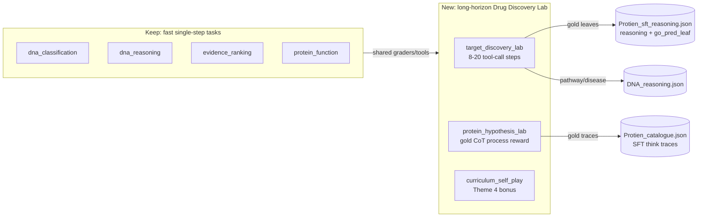

# Bioresearch Environment — Hackathon Improvement Plan

Goal: win the Cerebral Valley hackathon by turning the current 4 single-step
bioresearch tasks into a **long-horizon, tool-calling "Drug Discovery Lab"**
that trains frontier models to reason about disease mechanisms, aging
biology, and druggable targets — and prove it with a live GRPO reward
curve trained from the new reasoning-trace datasets.

Target themes (from `knowledgebase/requirements.md`):

- Primary: **Theme 3.1 — World Modeling / Professional Tasks** (scientific
  workflow loop: target → evidence → hypothesis → intervention).
- Primary: **Theme 2 — (Super) Long-Horizon Planning & Instruction
  Following** (multi-step tool use with sparse terminal reward + dense
  process reward across 8–20 steps per episode).
- Bonus: **Theme 4 — Self-Improvement** via a curriculum-self-play mode
  that bootstraps from `data/Protien_catalogue.json` SFT reasoning traces.
- Stretch bonus: **Theme 1 — Multi-Agent** via an optional Principal
  Investigator ↔ Specialist dispatch mode.

Judging-criteria mapping:

- Environment Innovation (40%): tool-calling lab + process rewards from
  `<think>` traces is novel in the hackathon space. Same action/obs
  schema used by research frontier models (MCP-like tools) — clearly
  meaningful RL.
- Storytelling (30%): "aging / rare disease" narrative; demo shows an
  agent progressing from naming a target to a plausible mechanistic
  hypothesis + intervention.
- Reward Improvement (20%): before/after reward curves from a short
  GRPO run on a single 8B model, trained on the new dense process
  rewards (these curves are the deliverable, not a finished model).
- Reward + Training Script (10%): a Colab using Unsloth + TRL GRPO
  against the live OpenEnv server — the minimum requirement.

---

## 1. What changes, at a glance



The existing 4 single-step tasks stay as "fast-mode" evaluators (used in
tests, docs, and as unit-level shaping signals). The headline product is
the new multi-step **`target_discovery_lab`** task plus the
**`protein_hypothesis_lab`** process-reward variant.

---

## 2. The "Drug Discovery Lab" loop (new primary task)

Episode shape (long-horizon, partially observable):

1. **Reset** returns an aging- or disease-relevant opening brief:
   a pathway + mutated gene from `data/DNA_reasoning.json`, *without*
   the final disease label. The agent's job is to cure/understand it.
2. **Phased state machine** (soft phases, not hard walls):
   `TARGET → CHARACTERIZE → HYPOTHESIZE → INTERVENE → SUBMIT`.
   Each `step(action)` either calls a **tool** or advances the phase.
3. **Tool menu** (exposed via `action.tool_name` + `action.tool_args`):
   - `get_interpro(protein_id)` — returns `interpro_formatted` from
     `Protien_sft_reasoning.json` / `Protien_catalogue.json`.
   - `get_ppi(protein_id)` — returns `ppi_formatted` /
     `interaction_partners`.
   - `get_go(protein_id, branch="bp|mf|cc|leaf")` — returns the GO
     slice (including the new `go_pred_leaf`).
   - `get_sequence(protein_id, window=None)` — returns the amino-acid
     sequence, optionally a window.
   - `get_pathway(gene_symbol)` — pathway neighbours from DNA dataset.
   - `search_catalogue(keyword)` — retrieves matching protein IDs from
     `Protien_catalogue.json` (used for the self-play curriculum).
4. **Terminal action** (`action.submit=True`) commits:
   `answer` (disease/mechanism), `reasoning` (multi-step chain),
   `go_terms` (leaf-level predictions), `proposed_intervention`
   (`inhibit|activate|degrade|chaperone|upregulate` + target).
5. Episode ends when the agent submits OR after `MAX_STEPS=20`.

GRPO properties are preserved:

- `reset(task_id=...)` is deterministic (gold data + seeded distractor
  pools).
- Every tool call is a pure function of `(task_id, tool_name, args)`.
- Process rewards are computed from a fixed gold trace → same
  (prompt, response) always yields the same reward.

---

## 3. Reward design

All rewards stay in `[0.01, 0.99]` so current GRPO infra keeps working.
The terminal reward is a weighted sum; process rewards are returned
per-step via `observation.metadata["step_reward"]` so TRL/Unsloth can
consume them as auxiliary signals.

`target_discovery_lab` terminal (max = 1.0 before clamp):

- Final disease match: 25% (reuse `grade_dna_classification`).
- Mechanism reasoning: 25% (reuse `grade_dna_reasoning.reasoning_component`).
- Leaf GO hit on implicated protein: 15% (new: F1 vs `go_pred_leaf`).
- Intervention plausibility: 15% (new grader; see §3.1).
- Tool efficiency: 10% (−penalty for redundant / unused calls).
- Trace coherence: 10% (alignment of reasoning steps with tool
  evidence — each reasoning claim must cite a tool result).

`protein_hypothesis_lab` terminal:

- Function Jaccard / location / GO-leaf F1 (re-uses current
  `grade_protein_function` but swapped to `go_pred_leaf` for GO).
- NEW **process reward** per reasoning step: embedding or ROUGE-L
  similarity of each emitted step against the ordered steps extracted
  from the `<think>` block in `Protien_catalogue.json` /
  `reasoning` in `Protien_sft_reasoning.json`. This is what gives
  GRPO the dense signal we need for a visible reward curve in 1–2
  hours of training.

### 3.1 New graders (in `server/graders.py`)

- `grade_intervention(proposal, gold_sample) -> (score, breakdown)`
  — checks that the proposed mode-of-action matches the protein's
  molecular function class (e.g. "inhibit" for a kinase, "chaperone"
  for a misfolder, "degrade" for a scaffolding protein) using an
  InterPro-family → MoA lookup table (curated ~40 entries).
- `grade_tool_efficiency(tool_calls, gold_evidence) -> (score, breakdown)`
  — rewards calling tools whose results were *actually used* in the
  final reasoning (string-match evidence fragments).
- `grade_process_trace(predicted_steps, gold_steps) -> (score, breakdown)`
  — stepwise similarity using `difflib.SequenceMatcher` over
  normalized gene/term tokens (no GPU needed).
- `grade_leaf_go_f1(predicted, gold_leaf) -> (score, breakdown)`
  — F1 restricted to leaf GO terms (strictly more discriminative
  than the current `grade_protein_function`'s flat-set F1).

---

## 4. Dataset integration (using the two new files)

### 4.1 `data/Protien_sft_reasoning.json` (100 rows)

Primary upgrade for `protein_function` and `protein_hypothesis_lab`:

- Replace the current `Protein_data.json` load with this file in
  [`server/data_loader.py`](server/data_loader.py). The feature set
  already contains everything the old file had plus `reasoning`,
  `final_answer`, `go_pred`, `go_pred_leaf`, `interaction_partners`,
  `structure_path`.
- Extend `ProteinSample` with `reasoning: str`, `final_answer: str`,
  `go_pred_leaf: str`, `interaction_partners: List[str]`,
  `go_bp_leaf/mf_leaf/cc_leaf: str`.
- Use `go_pred_leaf` as the *primary* grading target for GO
  predictions (huge signal: the current grader penalises correct
  leaves drowned under gold ancestor chains — the leaf file fixes
  this).

### 4.2 `data/Protien_catalogue.json` (100 rows)

Drives the **process reward** and the **Theme 4 self-play curriculum**:

- Parse the `generation` field as `{think_block, structured_answer}`
  by splitting on `</think>`.
- Extract ordered "reasoning steps" from `think_block` via the
  existing `_extract_steps` helper — these become the gold CoT used
  by `grade_process_trace`.
- In `curriculum_self_play` mode: the environment samples a protein,
  hides the structured_answer, asks the agent to emit a full
  reasoning trace + final summary, and grades against the SFT
  generation. Difficulty escalates by progressively hiding
  InterPro / PPI / sequence hints over episodes.

### 4.3 Keeping the current `DNA_reasoning.json`

Untouched. It anchors the "opening brief" of the lab loop (pathway +
genes) and continues to power Tasks 1/2/3 unchanged.

---

## 5. Action / Observation schema changes

`models.py`:

```python
class BioresearchAction(Action):
    task_id: str
    # NEW: tool-calling fields
    tool_name: Optional[str] = None         # e.g. "get_interpro"
    tool_args: Optional[Dict[str, Any]] = None
    submit: bool = False                    # terminal action flag
    # Existing (used when submit=True)
    answer: str = ""
    reasoning: Optional[str] = None
    go_terms: Optional[List[str]] = None
    subcellular_location: Optional[str] = None
    ranked_diseases: Optional[List[str]] = None
    elimination_reasoning: Optional[Dict[str, str]] = None
    # NEW
    proposed_intervention: Optional[Dict[str, str]] = None  # {mode, target}
```

`BioresearchObservation` gains:

- `phase: str` ("TARGET" | "CHARACTERIZE" | …).
- `tool_result: Optional[Dict[str, Any]]` — response to the last
  tool call.
- `remaining_steps: int`.
- `notebook: List[Dict[str, Any]]` — accumulated evidence the env
  has already returned (lets a fresh context window reconstruct
  state; crucial for the "long-horizon beyond context" criterion).

Backward compatibility: when `task_type` is one of the 4 legacy
task names, `submit` defaults to `True` and the old single-step
grading path runs.

---

## 6. File-by-file change list

- [`models.py`](models.py): add tool-calling + phase fields as above.
- [`server/data_loader.py`](server/data_loader.py): switch protein
  loader to `Protien_sft_reasoning.json`; add `CatalogueLoader` for
  `Protien_catalogue.json`; expose `get_tool_response(task_id,
  tool_name, args)` used by the env.
- [`server/bioresearch_environment.py`](server/bioresearch_environment.py):
  - add `_lab_step(action)` implementing the phased loop + tool
    dispatch + per-step shaping reward;
  - keep `_legacy_step` for the 4 existing tasks;
  - add `"target_discovery_lab"`, `"protein_hypothesis_lab"`,
    `"curriculum_self_play"` task types.
- [`server/graders.py`](server/graders.py): add `grade_intervention`,
  `grade_tool_efficiency`, `grade_process_trace`,
  `grade_leaf_go_f1`. Refactor `grade_protein_function` to delegate
  GO scoring to `grade_leaf_go_f1` when leaf data is present.
- [`client.py`](client.py): serialize the new `tool_name/tool_args/
  submit/proposed_intervention` fields; deserialize `phase`,
  `tool_result`, `remaining_steps`, `notebook`.
- [`inference.py`](inference.py): add a lab-mode driver that loops
  until `done`, builds a rolling user prompt from `notebook`, and
  parses `{"tool": ..., "args": ...}` or
  `{"submit": true, ...}` JSON from the LLM.
- [`openenv.yaml`](openenv.yaml): declare 3 new tasks; keep legacy 4.
- [`playground.py`](playground.py): add a "Lab Mode" tab with a live
  tool-call visualiser (the storytelling win).
- [`tests/test_graders.py`](tests/test_graders.py),
  [`tests/test_environment.py`](tests/test_environment.py): add
  tests for the new graders and the lab loop (tool dispatch,
  process reward, curriculum escalation).
- [`README.md`](README.md): refresh motivation to the aging / drug
  discovery narrative, add Lab Mode section, add baseline-vs-
  trained reward table placeholder.
- NEW `notebooks/train_grpo_colab.ipynb`: end-to-end Colab
  (Unsloth + TRL GRPO) that:
  1. Spins up the environment from the HF Space URL,
  2. Runs a cold baseline across 20 held-out episodes,
  3. Trains for N steps with GRPO against
     `protein_hypothesis_lab`,
  4. Plots reward curves (mean, process, terminal),
  5. Re-runs the baseline and reports the delta.

---

## 7. Minimum-requirement deliverables checklist

- [ ] OpenEnv latest — already in [`pyproject.toml`](pyproject.toml),
      re-pin to the newest tag in Phase 5.
- [ ] Unsloth/TRL Colab GRPO script — `notebooks/train_grpo_colab.ipynb`.
- [ ] <2 min HF blog or YouTube — script outline committed at
      `knowledgebase/pitch.md` (to be filmed on-site).

---

## 8. Phased implementation order

Phase A — Data + schema (foundational, blocks everything):

1. Swap protein loader → `Protien_sft_reasoning.json`; add leaf-GO
   fields to `ProteinSample`.
2. Add `CatalogueLoader` + `<think>` splitter.
3. Extend `BioresearchAction` / `BioresearchObservation`.

Phase B — Graders (pure functions, unit-testable in isolation):

4. `grade_leaf_go_f1` and retrofit `grade_protein_function`.
5. `grade_process_trace` (gold from catalogue).
6. `grade_intervention` with a small curated MoA table.
7. `grade_tool_efficiency`.

Phase C — Lab loop (depends on A + B):

8. Implement tool registry in the environment.
9. Implement `_lab_step` phased state machine + `notebook`
   accumulation.
10. Wire `target_discovery_lab`, `protein_hypothesis_lab`,
    `curriculum_self_play` task types.

Phase D — Client / inference / playground:

11. Update `client.py` serialization + `inference.py` lab driver.
12. Update `playground.py` with Lab Mode visualiser.

Phase E — Training + pitch:

13. Write `notebooks/train_grpo_colab.ipynb` (baseline → train →
    plot → re-eval).
14. Record reward curves + produce before/after trace comparison
    for the pitch.
15. Refresh `README.md` + write `knowledgebase/pitch.md`.

---

## 9. Risks & mitigations

- **Context blow-up on long episodes.** Mitigation: `notebook`
  field carries *summarised* tool outputs (each capped at 400
  chars) so a single prompt stays under 8k tokens even at step 20.
- **Process reward noise.** Mitigation: use the catalogue's
  `<think>` blocks as the *sole* gold CoT (one per protein) and
  score with tokenised SequenceMatcher — deterministic and local,
  no embedding API dep.
- **GRPO reward curve fails to move in 1 hour.** Mitigation: seed
  a short SFT warm-up on the catalogue traces first (we already
  have 100 labelled `<think>` examples). Unsloth SFT + GRPO in the
  same notebook.
- **Scope creep from Multi-Agent (Theme 1) stretch.** Treat strictly
  as bonus — implement only if Phases A–E are green by day 1.
- **Dataset file spelling** (`Protien_*` vs `Protein_*`). Lock the
  filenames as-is in the loader to avoid git-rename churn before
  the submission deadline; fix the typo post-hackathon.

---

## 10. What "winning" looks like in the 3-minute pitch

1. Frame: "We teach a frontier model to act like a biomedical PI
   hunting a druggable target for an aging-linked disease."
2. Live demo: paste a pathway+mutation; the agent's tool-call
   trace streams into the Playground; it lands on the correct
   target, predicts leaf GO terms, proposes a PROTAC-style degrade.
3. Before/after reward curves slide: flat cold baseline → climbing
   curve after 500 GRPO steps driven by the new process reward.
4. Call out the three reward components (terminal, process, tool
   efficiency) and the two new datasets powering them.
5. Closing: "This is the scaffold for Theme 3.1 + Theme 2, it
   extends to self-play (Theme 4) out of the box, and every tool
   is an MCP — plug any model in."
